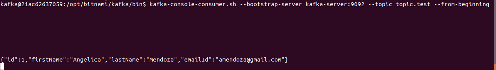

# Example of Spring Boot with Kafka 

# Introduction

https://kafka.apache.org/intro.html

## Kafka Architecture

In the above diagram, a topic is configured into three partitions. Partition 1 has two offset factors 0 and 1. Partition 2 has four offset factors 0, 1, 2, and 3. Partition 3 has one offset factor 0. The id of the replica is same as the id of the server that hosts it.

Assume, if the replication factor of the topic is set to 3, then Kafka will create 3 identical replicas of each partition and place them in the cluster to make available for all its operations. To balance a load in cluster, each broker stores one or more of those partitions. Multiple producers and consumers can publish and retrieve messages at the same time.

https://www.tutorialspoint.com/apache_kafka/apache_kafka_fundamentals.htm

## Prerequisites
* Kafka version: 2.4.0
* Zookeeper version: 3.6.0

### 1.- Example of producer 

View messages produced on topic.test (before)

Run Spring Boot Application

Send first message

View messages produced on topic.test (after)

Send second message

View messages produced on topic.test (after)

### 2.- Example of Consumer 

View messages produced on topic.test 

Run Spring Boot Application

Consume all message of topic.test 
 

